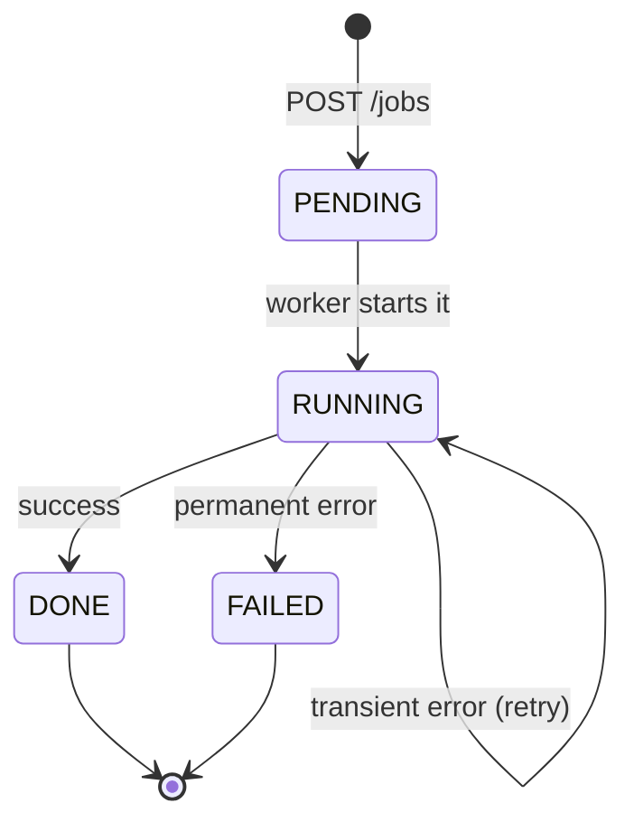
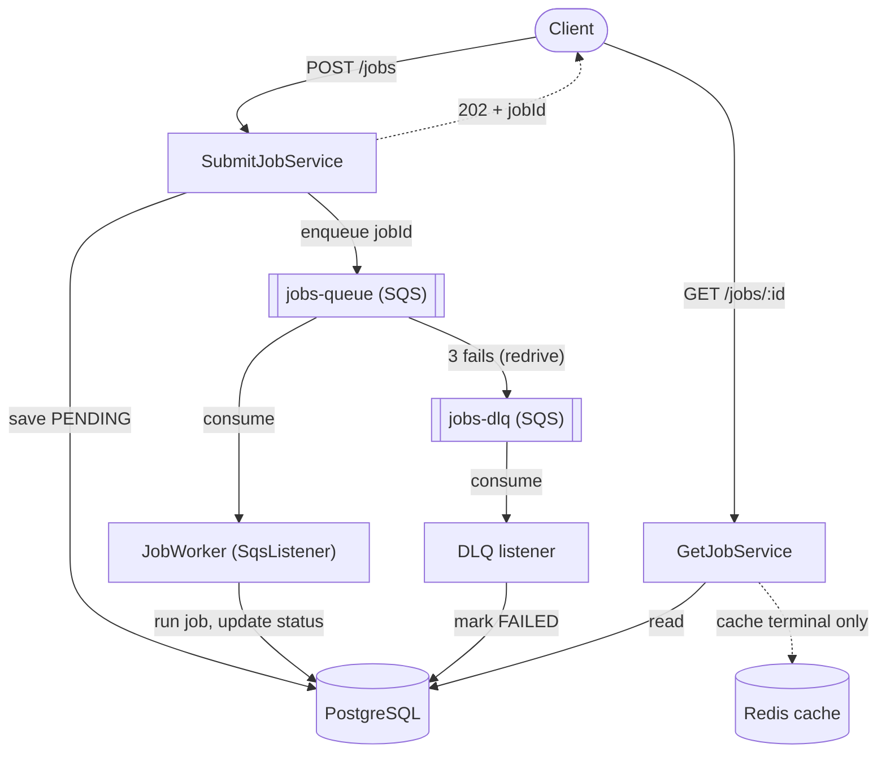

# Job Orchestrator

An asynchronous job processing service, built in three phases: clean architecture, then scalability, then distributed and event-driven. Java 21, Spring Boot 3, PostgreSQL, SQS.

You submit a job, you get an ID back immediately, a worker runs it in the background off a queue, and you poll the ID to see how it went.

**Status: all three phases done.** The system is now distributed and event-driven — the API just enqueues, a separate worker consumes and runs the job. See the [roadmap](#roadmap).

---

## Why this exists

I wanted to prove I can design an async job-processing system and defend every decision in it, not just get it working.

So this repo optimizes for something unusual: the reasoning is the deliverable. Every non-obvious choice has an [ADR](docs/adr/) explaining what I picked, what I gave up, and when I'd change my mind. The code is small. The thinking is the point.

It's not a product. Nobody's going to use it to send emails.

---

## How it works

You `POST` a job. The API creates it as `PENDING`, drops its id on a queue, and returns **`202 Accepted`** immediately — it does **not** run the work. A separate worker pulls the id off the queue, runs the job, and updates its status. You `GET` the id to watch it move:



Invalid transitions are impossible, not discouraged. `PENDING -> DONE` throws. `DONE -> RUNNING` throws. The `Job` object refuses to be put into an inconsistent state, so no caller can bypass the rules — not the controller, not the worker, not me at 2am.

Right after `POST`, a `GET` will usually show `PENDING` — the worker hasn't picked it up yet. That's not a bug, it's **eventual consistency**: the natural cost of decoupling. In exchange, the API stays responsive under load instead of blocking on a 30-second job.

There is deliberately no endpoint to set a job's status. More on that below.

---

## Architecture

Two views: the layers (hexagonal) and the runtime (distributed).

### Layers — dependencies point inward

```
infrastructure/          Spring, JPA, HTTP and SQS live here
  web/                   JobController, request/response DTOs, RateLimitFilter
  persistence/           JobEntity, JpaJobRepositoryAdapter
  messaging/             SqsJobQueue (producer), JobWorker (@SqsListener consumer)
  JobBeanConfig          wires use cases into Spring
        |
        | depends on
        v
application/             Pure Java, no framework
  JobRepository, JobQueue, JobTaskRunner   ← ports (interfaces I own)
  SubmitJobService, GetJobService, ExecuteJobService, DeadLetterService
        |
        | depends on
        v
domain/                  Pure Java, no framework
  Job, JobStatus         the rules live here
```

`domain/` and `application/` contain zero Spring, JPA or AWS imports. The test for whether that's real: if I deleted Spring Boot, could I still test my business rules? Yes — the unit tests run with no database, no Spring context and no Docker, in milliseconds.

### Runtime — producer, queue, worker



The queue holds only the **jobId** (a small "ticket"); the full job record lives in Postgres (the single source of truth). The worker takes a ticket, loads the job, runs it, and updates the DB.

Everything about jobs lives under `job/`. Package-by-feature, not `controller/` + `service/` + `entity/` — the whole feature is in one place.

---

## Tech stack

| Layer | Choice | Why |
|-------|--------|-----|
| Language | Java 21 (LTS) | Records, virtual threads, pattern matching |
| Framework | Spring Boot 3.4 | Jakarta EE 10, mature ecosystem |
| Database | PostgreSQL 16 | Boring is good |
| Migrations | Flyway | Versioned SQL in git. `ddl-auto` is `validate`, so Hibernate never touches the schema |
| Queue | AWS SQS (via spring-cloud-aws) | Managed, at-least-once, no ops. Run locally on LocalStack |
| Local AWS | LocalStack | Fakes SQS on `localhost:4566` — same SDK, no account, no bill |
| Cache | Redis 7 | Caches terminal `GET /jobs/{id}` (Phase 2) |
| Rate limiting | Bucket4j | Token bucket, per-IP, on `POST /jobs` (Phase 2) |
| Build | Maven (wrapper) | `./mvnw` works anywhere, no global install |
| API docs | springdoc-openapi | Swagger UI at `/swagger-ui.html` |
| Testing | JUnit 5, AssertJ, Testcontainers | Real Postgres in tests, not H2 |
| Containers | Docker Compose | Postgres, Redis and LocalStack in one command |

---

## Quick start

You need Java 21 and Docker.

```bash
git clone https://github.com/erdemsidal/orchestra.git
cd orchestra

# Postgres + Redis + LocalStack (creates the SQS queues on startup)
docker compose up -d

# Flyway creates the schema on startup
./mvnw spring-boot:run
```

The app runs on `http://localhost:8080`. Swagger UI is at `http://localhost:8080/swagger-ui.html`.

Try it:

```bash
# Submit a job — returns immediately, the work runs in the background
curl -X POST http://localhost:8080/api/jobs \
  -H "Content-Type: application/json" \
  -d '{"type":"send-email"}'
# 202 {"id":"b4f43279-...","type":"send-email","status":"PENDING"}

# Poll it — PENDING at first (eventual consistency), then RUNNING, then DONE
curl http://localhost:8080/api/jobs/b4f43279-...
# 200 {"id":"b4f43279-...","type":"send-email","status":"DONE"}
```

Watch the queue live while you POST: `bash localstack/watch-queue.sh`.

---

## API

| Method | Endpoint | Description |
|--------|----------|-------------|
| `POST` | `/api/jobs` | Submit a job. Returns **202 Accepted** with the job ID, status `PENDING`. A worker runs it asynchronously |
| `GET` | `/api/jobs/{id}` | Get a job's current status (`PENDING`/`RUNNING`/`DONE`/`FAILED`). 404 if it doesn't exist |
| `GET` | `/api/health` | Health check |
| `GET` | `/actuator/health` | Actuator health |

Two endpoints. No `PUT`, no `DELETE`. That's not laziness, see below.

---

## Distributed processing (Phase 3)

The API (producer) and the worker (consumer) are decoupled by an SQS queue. This is where the interesting distributed-systems problems live, and each one has an ADR:

- **Producer / async submit** — `POST` enqueues and returns in ~15ms instead of blocking on the job. The queue acts as a shock absorber: a traffic spike lengthens the queue instead of crashing the API.
- **Eventual consistency** — a `GET` right after `POST` shows `PENDING`. By design, not a bug.
- **Idempotency** — SQS delivers at-least-once, so the same message can arrive twice. The job's status *is* the dedup key: a job only leaves `PENDING` once, and a duplicate for an already-terminal job is skipped. No dedup table. ([ADR 0007](docs/adr/0007-idempotency.md), incl. the honest limit on concurrent duplicates.)
- **Retry + backoff** — a transient failure makes the worker rethrow; SQS redelivers after the visibility timeout (5s). No custom retry code — at-least-once *is* the retry. Backoff is fixed, not exponential ([ADR 0008](docs/adr/0008-retry-backoff-dlq.md)).
- **Dead-letter queue** — after 3 failed attempts (redrive policy), a message moves to `jobs-dlq` instead of looping forever. A DLQ listener marks the job `FAILED`.

Why SQS over Kafka/RabbitMQ, and LocalStack over real AWS: [ADR 0006](docs/adr/0006-kuyruk-teknolojisi.md).

---

## Performance: caching `GET /jobs/{id}`

Phase 2 rule: measure, change, measure again. Same k6 test both times — 50 virtual
users hammering `GET /jobs/{id}` for 30s. The only change between the two columns
is a `@Cacheable` annotation backed by Redis (5-minute TTL).

| Metric | No cache | With cache | Change |
|--------|----------|------------|--------|
| p50 | 11.74ms | 3.90ms | −67% |
| p95 | 19.51ms | 6.63ms | −66% (≈3× faster) |
| p99 | 29.19ms | 10.96ms | −62% |
| Throughput | 3,867 req/s | 11,192 req/s | ≈2.9× |

The endpoint is a single indexed primary-key read, so in isolation it's already
fast (~5ms). The win shows up **under load**: without the cache, concurrent
requests queue for one of Hikari's 20 DB connections and p95 climbs; the cache
serves them from Redis with no pool contention.

Cache invalidation would be a nightmare here, so we don't do it — we only cache
**terminal** jobs. A `DONE`/`FAILED` job never changes, so it's safe to cache
forever; `PENDING`/`RUNNING` are read fresh from the DB every time. (Phase 3 made
jobs async and this staleness became real — I caught it live and fixed it with a
one-line `unless` condition. Story in [ADR 0004](docs/adr/0004-cache-stratejisi.md).)

Reproduce it: `docker compose up -d && ./mvnw spring-boot:run`, then
`k6 run load-tests/get-job.js`.

## Rate limiting

`POST /jobs` triggers real work, so an abusive client could flood it. A servlet
filter enforces a **token bucket** (Bucket4j) per client IP — 20 requests/second
with a burst of 20 — before the request ever reaches the controller. Over the
limit gets `429 Too Many Requests` with a `Retry-After` header. Measured: 100
concurrent POSTs → 61 through, 39 rejected.

Token bucket allows short bursts (up to the bucket capacity) but caps the
sustained rate at the refill rate — which is what you actually want, since real
users click in bursts. Reasoning, plus the honest limitations (per-IP is crude
behind NAT; in-memory buckets don't span multiple instances), in
[ADR 0005](docs/adr/0005-rate-limiting.md).

---

## Testing

```bash
./mvnw test
```

Unit tests (domain + application) run with fakes — no DB, no Spring, no Docker — in
milliseconds, and answer "are my rules correct?". A handful of Testcontainers
integration tests spin up a **real** PostgreSQL and answer "are the pieces wired
correctly?". That's the test pyramid: a wide base of fast tests, a few slow ones on
top. Not H2 — it doesn't faithfully emulate Postgres's UUID type, indexes or SQL
dialect, and "passed in tests, exploded in prod" starts right there.

---

## Why these decisions?

This is the section I wish more repos had. Full reasoning lives in [`docs/adr/`](docs/adr/).

### Why a repository/queue **port** instead of using the framework directly?

Not so I can swap Postgres for MongoDB or SQS for RabbitMQ. Nobody does that, and saying it in an interview should earn you a raised eyebrow.

The real reason is testing. `SubmitJobService` has to save and enqueue. If it depends on Spring Data / the AWS SDK directly, testing it needs a real database and a real queue. Depending on `JobRepository` and `JobQueue` — interfaces I own — I hand it fakes (a `HashMap`, a lambda) and the test runs in a millisecond. The infrastructure adapters (`JpaJobRepositoryAdapter`, `SqsJobQueue`) are the only things that touch the framework.

### Why is `JobEntity` a separate class from `Job`?

Because JPA's requirements would destroy the domain's guarantees. JPA needs a no-arg constructor, but `Job`'s constructor is exactly where "a new job is always PENDING" is enforced. JPA needs setters, but `Job` deliberately has none, because status only moves through `start()`, `markDone()` and `markFailed()`. Kept apart, `JobEntity` obeys JPA and `Job` obeys the business. An adapter translates.

### Why no `PUT /jobs/{id}` or `DELETE`?

If I exposed `updateJob(status)`, a client could `PUT {"status":"DONE"}` on a job that never ran — bypassing every state rule in one request. Status isn't a field you set; it's the consequence of something happening. And `DELETE`? A job is a record ("this ran last Tuesday and failed"). You don't delete history. This is CRUD thinking vs use-case thinking: the answer to "what can a user actually do?" is two things, so there are two endpoints.

### Why send only the jobId on the queue, not the whole job?

Messages stay small, and there's one source of truth (the DB). If I copied the job's data into the message, that copy could go stale. The worker takes the id and reads the current truth from Postgres.

### Why the job's status as the idempotency key, instead of a dedup table?

The job already has a natural single-transition guard (`start()` only works from `PENDING`). Reusing it avoids an extra table and an extra write. The trade-off (concurrent duplicate delivery) is documented honestly in [ADR 0007](docs/adr/0007-idempotency.md).

### A few more, briefly

- **No `@Service` on use cases** — keeps `application/` framework-free; `JobBeanConfig` wires them.
- **`VARCHAR` status, not ordinal** — reorder the enum and every historical `0`/`1` silently changes meaning.
- **State machine inside `Job`** — four states, almost linear; a dedicated class would be over-engineering ([ADR 0001](docs/adr/0001-durum-yonetimi.md)).

---

## Decision records

The reasoning behind everything, one file each in [`docs/adr/`](docs/adr/):

| # | Decision |
|---|----------|
| [0001](docs/adr/0001-durum-yonetimi.md) | State transitions live inside `Job`, not a separate state machine |
| [0002](docs/adr/0002-api-tasarimi-use-case.md) | Use-case API, not CRUD (no `PUT`/`DELETE`) |
| [0003](docs/adr/0003-paket-yapisi.md) | Package-by-feature with flat layers |
| [0004](docs/adr/0004-cache-stratejisi.md) | Cache only terminal jobs (invalidation avoided) |
| [0005](docs/adr/0005-rate-limiting.md) | Token-bucket rate limiting, per-IP, app layer |
| [0006](docs/adr/0006-kuyruk-teknolojisi.md) | SQS over Kafka/RabbitMQ, on LocalStack |
| [0007](docs/adr/0007-idempotency.md) | Job status as the idempotency key |
| [0008](docs/adr/0008-retry-backoff-dlq.md) | Retry via SQS redelivery, DLQ via redrive policy |

---

## Roadmap

**Phase 1 — Clean architecture. Done.**
Synchronous, single service. Hexagonal layers, Postgres and Flyway, unit and integration tests, Docker Compose.

**Phase 2 — Scalability. Done.**
Redis caching (a measured 3× p95 improvement), token-bucket rate limiting, k6 load tests, Actuator/Prometheus metrics.

**Phase 3 — Distributed and event-driven. Done.**
The worker split out from the API with an SQS queue between them. Async submit, a `@SqsListener` worker, idempotency, retry, dead-letter queue, eventual consistency — all running on LocalStack.

---

## Not included yet

Being honest about the gaps:

- **CI.** Deferred. The tests pass locally (`./mvnw test`); wiring a green pipeline that also runs the Testcontainers integration tests is a task for later. Better no pipeline than a red one that lies.
- **Exponential backoff.** Retry backoff is currently fixed (the SQS visibility timeout). True exponential backoff needs per-attempt `ChangeMessageVisibility` ([ADR 0008](docs/adr/0008-retry-backoff-dlq.md)).
- **Concurrent duplicate delivery.** The status-based idempotency covers redelivery; two truly simultaneous deliveries could race ([ADR 0007](docs/adr/0007-idempotency.md)).
- **Separate worker deployment.** The worker runs in-process today; a real deployment would run it as its own scalable service (same `@SqsListener` code).
- **Authentication.** Deliberately stripped — this is an architecture study, and auth would have been scope creep.

---

## License

MIT.

## About

Built by Erdem Sidal as a study in async job-processing architecture, and in being able to explain it.
